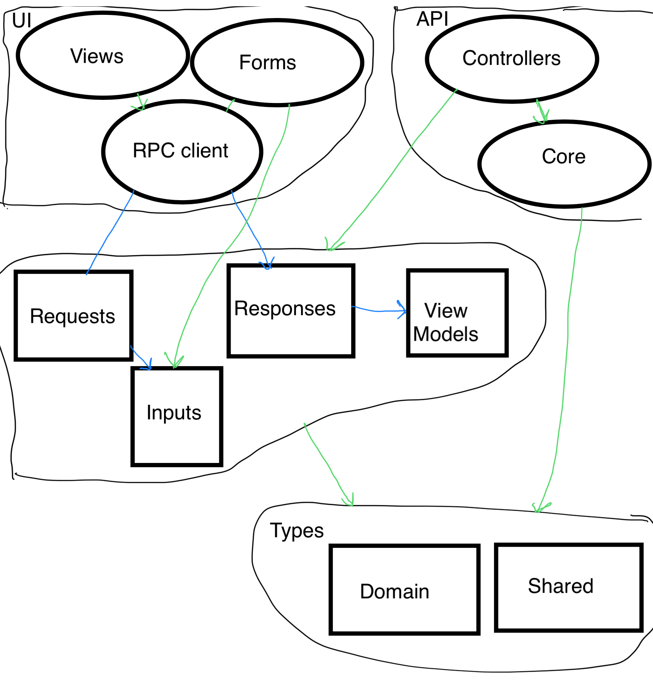

# @effect-app/boilerplate

## Setup

1. `pnpm i` from root
2. open a typescript file, and set VSCode's Typescript version to use the workspace version:
   - TypeScript: Select TypeScript version: Use workspace version

## Run

(VSCode tasks.json in progress)

### API & Libs

a) `pnpm build -w`
b) `cd apps/api && pnpm dev`

Visit: http://localhost:3610/docs
The API is also proxied in the frontend on /api

### Frontend (Nuxt)

- `cd apps/frontend-nuxt && pnpm dev -o`

Visit: http://localhost:5281
API Docs: http://localhost:5281/api/docs

Notes

- Make sure you don't have the old Vue/Vetur vs code plugin installed, but the new ones only: "Vue.volar", "Vue.vscode-typescript-vue-plugin"

### Helpful editor hints

Add to keybinds:

```json
{
    "key": "ctrl+shift+i",
    "command": "editor.action.sourceAction",
    "args": {
        "kind": "source.addMissingImports",
        "apply": "first"
    }
}
```


### Data type architecture/hierarchy

Sketch..


